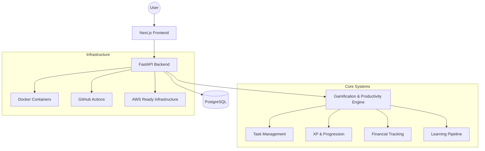

# 🚀 Aikira Platform


---

# 🧠 Overview

**Aikira Platform** is an engineering-focused personal operating system designed to transform long-term professional goals into a scalable productivity and progression platform.

The project combines:

* task orchestration
* gamification systems
* financial tracking
* learning pipelines
* cloud-native architecture
* DevOps workflows
* real-world engineering practices

Its long-term vision is to evolve into an international AI-driven educational and productivity ecosystem.

---

# 🇯🇵 <ruby>長期的<rt>ちょうきてき</rt></ruby>な<ruby>構想<rt>こうそう</rt></ruby> | Vision

<ruby>Aikira<rt>アイキラ</rt></ruby> は、<ruby>技術<rt>ぎじゅつ</rt></ruby>・<ruby>教育<rt>きょういく</rt></ruby>・AI・<ruby>国際的<rt>こくさいてき</rt></ruby>な<ruby>成長<rt>せいちょう</rt></ruby>を<ruby>統合<rt>とうごう</rt></ruby>するためのプラットフォームです。

<ruby>毎日<rt>まいにち</rt></ruby>の<ruby>積<rt>つ</rt></ruby>み<ruby>重<rt>かさ</rt></ruby>ねを<ruby>通<rt>とお</rt></ruby>して、<ruby>実践的<rt>じっせんてき</rt></ruby>なソフトウェア<ruby>工学<rt>こうがく</rt></ruby>とクラウド<ruby>技術<rt>ぎじゅつ</rt></ruby>を<ruby>学習<rt>がくしゅう</rt></ruby>しています。

このプロジェクトは、<ruby>継続的<rt>けいぞくてき</rt></ruby>な<ruby>改善<rt>かいぜん</rt></ruby>と<ruby>国際的<rt>こくさいてき</rt></ruby>なエンジニアリングキャリアを<ruby>目的<rt>もくてき</rt></ruby>として<ruby>公開<rt>こうかい</rt></ruby>されています。

---

# 🏗️ Architecture

## High-Level System Design



---

# ☁️ Infrastructure Strategy

The platform follows a scalable cloud-oriented architecture designed for gradual evolution.

## Initial Infrastructure

* Vercel (Frontend)
* Render/Railway (Backend)
* PostgreSQL (Neon/Supabase)
* GitHub Actions
* Docker-based local development

## Future Infrastructure

* AWS ECS / EC2
* AWS RDS PostgreSQL
* AWS S3
* AWS CloudFront
* AWS Route53
* Terraform-ready infrastructure
* Container orchestration

---

# 🛠️ Tech Stack

## Frontend

* Next.js
* React
* TypeScript
* TailwindCSS

## Backend

* FastAPI
* Python
* REST API

## Database

* PostgreSQL

## DevOps & Cloud

* Docker
* GitHub Actions
* AWS (future migration)
* CI/CD Pipelines

## Engineering Practices

* Monorepo architecture
* Clean architecture principles
* Modular services
* Environment isolation
* Scalable infrastructure patterns

---

# 📦 Monorepo Structure

```plaintext
aikira/
│
├── apps/
│   ├── web/
│   └── api/
│
├── packages/
│
├── infra/
│
├── docs/
│
├── .github/
│
└── README.md
```

---

# ⚙️ Engineering Goals

This repository is designed to demonstrate:

* scalable backend architecture
* modern frontend engineering
* cloud-native thinking
* DevOps workflows
* CI/CD automation
* infrastructure evolution
* production-oriented coding standards
* long-term maintainability

---

# 🚀 Roadmap

## Phase 1 — Foundation

* [x] Monorepo setup
* [x] Initial architecture design
* [x] PostgreSQL integration
* [x] Docker environment
* [ ] Authentication system
* [ ] Task management engine
* [ ] XP progression system
* [ ] Financial tracking module

## Phase 2 — Platform Evolution

* [ ] AI-assisted productivity systems
* [ ] Analytics dashboard
* [ ] Internationalization (i18n)
* [ ] Advanced DevOps workflows
* [ ] Cloud migration strategy

## Phase 3 — Cloud Infrastructure

* [ ] AWS infrastructure
* [ ] Terraform provisioning
* [ ] Observability stack
* [ ] Scalable deployment pipeline
* [ ] Distributed services architecture

---

# 🧪 Local Development

```bash
# Clone repository
git clone https://github.com/profalexandretolentino/aikira.git

# Configure environment
cp .env.example .env

# Start containers
docker compose up -d

# Install dependencies
npm install

# Run frontend
cd apps/web
npm run dev

# Run backend
cd apps/api
uvicorn main:app --reload
```

---

# 🔐 Environment Strategy

Sensitive data is isolated using environment variables.

Example:

```env
DATABASE_URL=
OPENAI_API_KEY=
JWT_SECRET=
AWS_ACCESS_KEY_ID=
AWS_SECRET_ACCESS_KEY=
```

---

# 🌍 Languages

* English
* Portuguese
* Japanese (learning support)

---

# 👨‍💻 Engineering Philosophy

The platform is built around:

* continuous improvement
* real-world implementation
* public technical evolution
* long-term engineering discipline

The objective is not only product development, but also the creation of a scalable and internationally aligned engineering ecosystem.

---

# 📄 License

Licensed under the MIT License.

Developed by Alexandre Tolentino.
